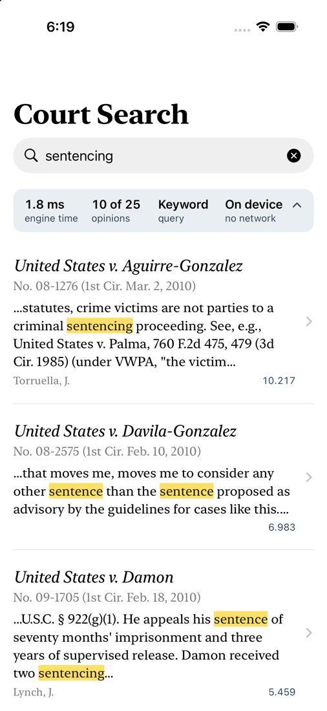
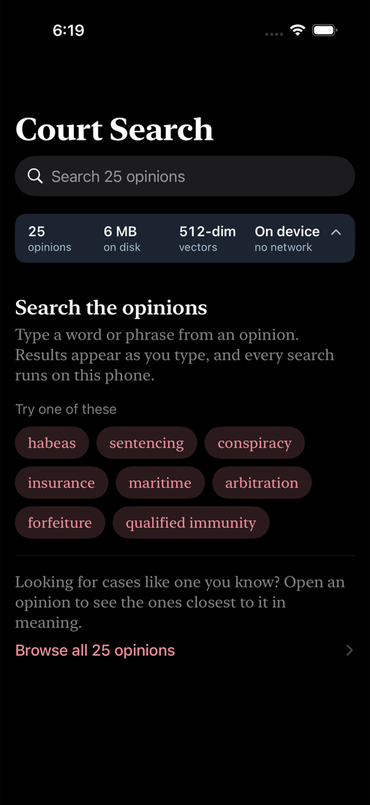
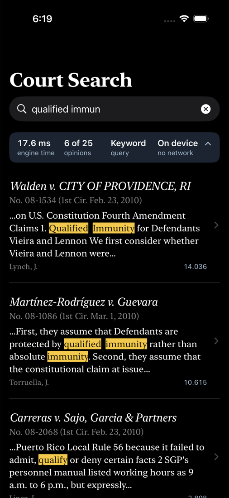
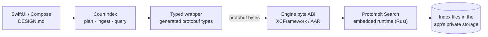

# Court Search — a Protomolt Search sample for iOS and Android

A legal research app in miniature that runs **entirely on the phone**: no
server, no network permission, no account. It is a working sample of
[Protomolt Search](https://github.com/ai-pipestream/protomolt-search), the
Pipestream search engine, embedded in ordinary native apps — SwiftUI on iOS,
Jetpack Compose on Android — through the engine's mobile packages.

<p>
  
  
  
</p>

## What it does

The app ships with 25 real opinions of the U.S. Court of Appeals for the First
Circuit. On first launch it builds a private search index inside its own
storage — about a second and a half on an iPhone XR — and from then on:

| | What you do | What the engine does, on the device |
| --- | --- | --- |
| **Keyword search** | Type `habeas`, or just `hab` | BM25 ranking with type-ahead. Results arrive as you type, each as a citation with the passage that matched. The engine cuts those passages and marks the matched words itself; the app only draws the highlighter |
| **Similar opinions** | Open any opinion | Nearest-neighbour search over 512-dimensional embeddings: the opinions closest in *meaning*, even where they share few words |
| **Engine panel** | Tap the slate strip under the search box | The engine's own account of the last query — its timing, how many opinions matched, the route it took — beside the index's size, vector dimensions, and build time |

The index survives closing the app: relaunch and it reopens what it built. The
app requests no network permission, and the engine package it links contains no
networking code at all.

## Why it exists

Protomolt Search's embedded runtime is designed to be the search backend of a
mobile app, and its documentation is candid that this had been compile-checked
but not yet run on phone hardware. This sample is that run, and a reference for
anyone doing the same:

- **The call sequence that works**: open → plan the index from a protobuf
  descriptor → mapped ingest → flush → query, all as protobuf bytes across the
  engine's C and JNI boundary.
- **The rules the engine enforces** that the mobile path does not yet document —
  which fields a shard must declare, which field an unqualified query searches,
  how analysis is bound, when snippets are served, how type-ahead interacts with
  stemming. They were learned from the engine's refusals and are written down in
  [PLAN.md](PLAN.md).
- **One design, two platforms**: both apps implement [DESIGN.md](DESIGN.md) and
  assert the same results in their tests.

## Results so far

| | Acceptance test | On hardware |
| --- | --- | --- |
| Host reference ([tools/wire-probe](tools/wire-probe)) | passes | — |
| iOS | passes (iPhone 17 simulator) | iPhone XR, iOS 18: first index build 2.23 s, then 1.52–1.58 s; 6.0 MB on disk; survives kill and relaunch |
| Android | passes on device | Pixel 11 Pro Fold, Android 17: index build 2.90 s; 6.0 MB on disk |

The acceptance test is the same everywhere: ingest the 25 opinions; `habeas`
returns *Forsyth v. Spencer* then *United States v. Dowdell*, with "habeas"
marked in the engine's snippet; `hab` finds the same two; the five nearest
neighbours of the first opinion come back in a fixed order; close, reopen, check
again. Those expectations match an independent implementation, the Java/Lucene
court sample in [protomolt](https://github.com/ai-pipestream/protomolt) — the
two engines agree on ranking, and on similarity scores to within quantization.

Timings are single debug-build measurements, not benchmarks.

## How it fits together



The engine is consumed exactly as an outside developer would consume it: a built
XCFramework or AAR plus its protobuf contracts, from a pinned revision. Nothing
in this repository changes the engine.

## Build and run

You need a checkout of
[protomolt-search](https://github.com/ai-pipestream/protomolt-search) **next to**
this repository, Rust with the mobile targets
(`rustup target add aarch64-apple-ios aarch64-apple-ios-sim x86_64-apple-ios aarch64-linux-android`),
and `protoc`.

**iOS** — Xcode 26, [XcodeGen](https://github.com/yonaskolb/XcodeGen).

```bash
scripts/build-engine.sh                 # engine → ios/Frameworks, about 5 minutes, once
cd ios && xcodegen generate && open CourtSearch.xcodeproj
```

Run the `CourtSearch` scheme. For a device, pick your team under Signing &
Capabilities. Launch arguments: `-query habeas` opens on results, and
`-resetIndex YES` rebuilds the index without reinstalling. The acceptance test is
the `CourtSearchKit` scheme (⌘U).

**Android** — Android SDK with an NDK, JDK 17 or newer.

```bash
scripts/build-engine-android.sh         # engine → android/libs, about 2 minutes, once
cd android && ./gradlew :app:installDebug
./gradlew :app:connectedDebugAndroidTest    # the acceptance test, on a device or emulator
```

`adb shell am start -n ai.pipestream.samples.courtsearch/.MainActivity --es query habeas`
opens on results; `--ez resetIndex true` rebuilds the index.

**Host reference** — the same engine calls from Rust, no phone involved:

```bash
cd tools/wire-probe && cargo run -- ../../fixtures/court_opinions_potion512.ndjson habeas
```

## Layout

```
README.md      you are here
PLAN.md        the engineering plan: what was verified, the engine rules, open questions
DESIGN.md      the UX spec both apps implement
proto/         court.proto — the opinion schema every platform plans its index from
fixtures/      25 opinions with metadata and precomputed embeddings; court.desc
tools/wire-probe/   host-side Rust reference for the engine's mobile byte ABI
ios/           CourtSearchKit (Swift package: engine wrapper + index) and the app
android/       the Android app (Kotlin, Jetpack Compose)
design/        the app icon master
scripts/       build the engine per platform; regenerate protobuf types, fixture, icons
```

## What comes next

**Search by meaning, typed by you.** Today "similar opinions" starts from an
opinion already in the index, because the phone has no way to turn *new* text
into an embedding; the 25 vectors were computed ahead of time. The next phase
puts a small static-embedding model on the device, so "police searched the car
without a warrant" finds the right opinions even if none uses those words. It
also lets us check that the phone computes the same vectors the laptop did — the
first evidence that two independent implementations of the model agree.

This sample is not the collaborative, device-owned-shard search described in the
engine's `docs/device-shards.md`; that design depends on this working first.

## Data, model, and license

- **Opinions**: U.S. federal court opinions, in the public domain, from
  [CourtListener](https://www.courtlistener.com/) by the Free Law Project. Each
  opinion in the app links back to its CourtListener page.
- **Embeddings**: computed with
  [`minishlab/potion-retrieval-32M`](https://huggingface.co/minishlab/potion-retrieval-32M)
  (MIT). The model itself is not in this repository; only the 25 resulting
  vectors are.
- **Code**: MIT, the same license as the engine's embedded package. See
  [LICENSE](LICENSE).
