# Court Search — a Protomolt Search sample for iOS and Android

A legal research app in miniature that runs **entirely on the phone**: no
server, no network permission, no account. It is a working sample of
[Protomolt Search](https://github.com/ai-pipestream/protomolt-search), the
Pipestream search engine, embedded in ordinary native apps — SwiftUI on iOS,
Jetpack Compose on Android — through the engine's mobile packages.

<p>
  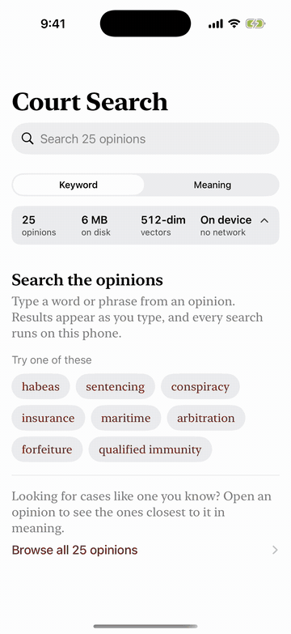
</p>

Search by meaning, start to finish, on the real engine
([full-quality video](docs/demo/meaning-journey.mp4)). The taps are scripted so the
tour can be recorded; launch the app with `-demo meaning` to watch it yourself.

## What it does

The app ships with 25 real opinions of the U.S. Court of Appeals for the First
Circuit. On first launch it builds a private search index inside its own
storage — about a second and a half on an iPhone XR — and from then on:

| | What you do | What the engine does, on the device |
| --- | --- | --- |
| **Keyword search** | Type `habeas`, or just `hab` | BM25 ranking with type-ahead. Results arrive as you type, each as a citation with the passage that matched. The engine cuts those passages and marks the matched words itself; the app only draws the highlighter |
| **Search by meaning** | Switch to Meaning and describe a situation: "insurance company refused to pay the claim" | The phone turns your words into a vector with a small embedding model it carries, and finds the nearest opinions, even ones that share no word with you |
| **See where the meaning is** | Open a Meaning result | The opinion's text shaded sentence by sentence by closeness to your question, with a jump to the closest passage. Each result also shows its nearest sentence and which of your words pulled it in |
| **Step through the marks** | In any opened result, the arrows at the bottom right | Previous and next highlight in reading order, with a counter: matched words in Keyword mode, shaded passages in Meaning mode. The highlighter means one thing everywhere: this is where your query landed |
| **Similar opinions** | Open any opinion | Nearest-neighbour search over 512-dimensional embeddings: the opinions closest in *meaning*, even where they share few words |
| **Engine panel** | Tap the slate strip under the search box | The engine's own account of the last query — its timing, how many opinions matched, the route it took — beside the index's size, vector dimensions, and build time |

The index survives closing the app: relaunch and it reopens what it built. The
app requests no network permission, and the engine package it links contains no
networking code at all.

## The journey, step by step

### Search by meaning

<table>
  <tr valign="top">
    <td align="center" width="25%">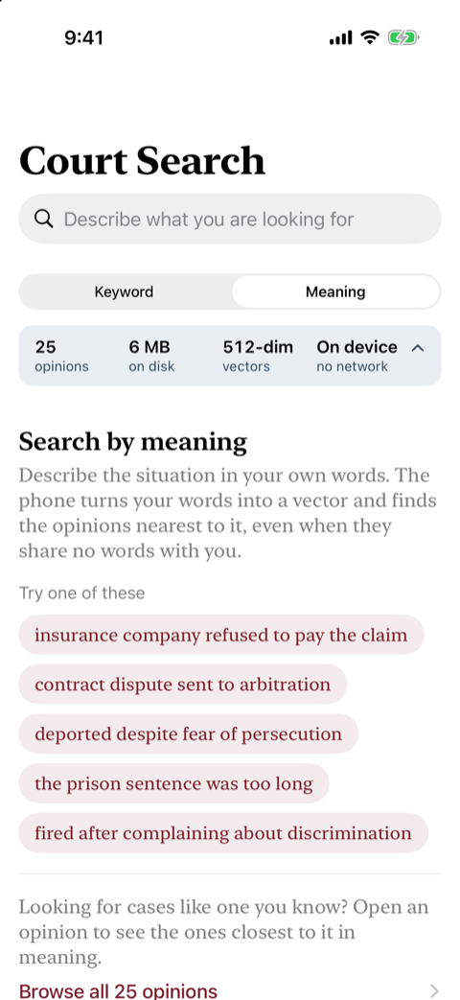<br><b>1. Ask in your own words</b><br><sub>Describe a situation, or pick a suggested question</sub></td>
    <td align="center" width="25%">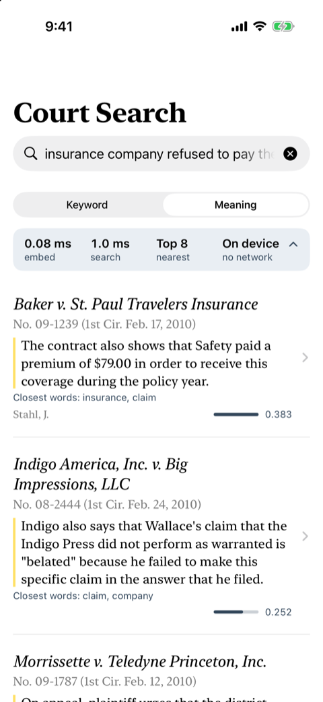<br><b>2. The nearest opinions</b><br><sub>Each with its closest sentence, the words that pulled it in, and a similarity bar</sub></td>
    <td align="center" width="25%">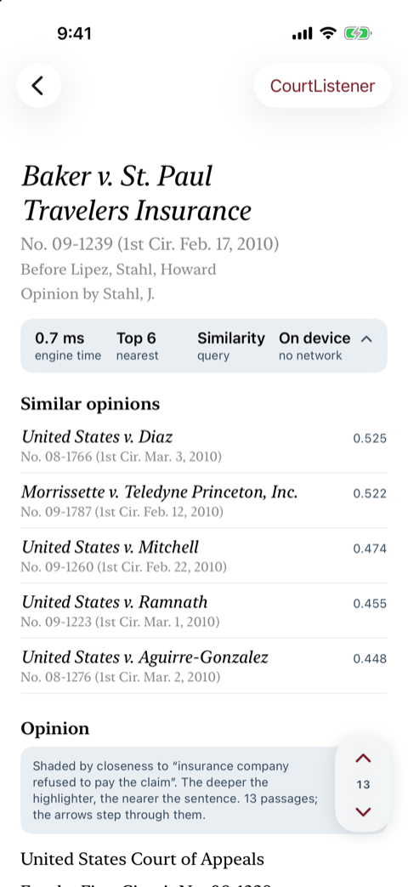<br><b>3. Open one</b><br><sub>Citation, similar opinions, and a note that the text is shaded by closeness to your question</sub></td>
    <td align="center" width="25%">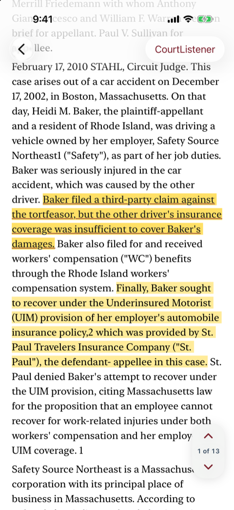<br><b>4. Step to a passage</b><br><sub>The arrows move through the shaded passages in reading order</sub></td>
  </tr>
  <tr valign="top">
    <td align="center" width="25%">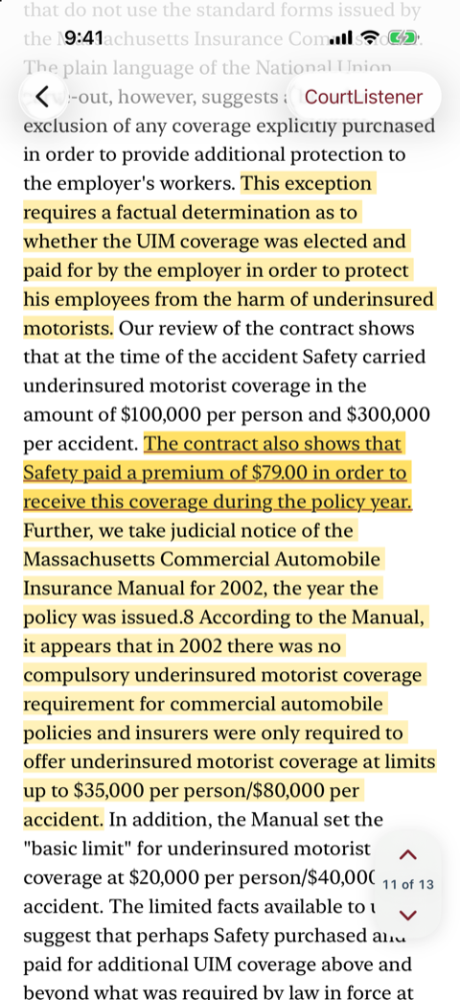<br><b>5. The closest passage</b><br><sub>Deeper highlighter means nearer; the current sentence is underlined</sub></td>
    <td align="center" width="25%">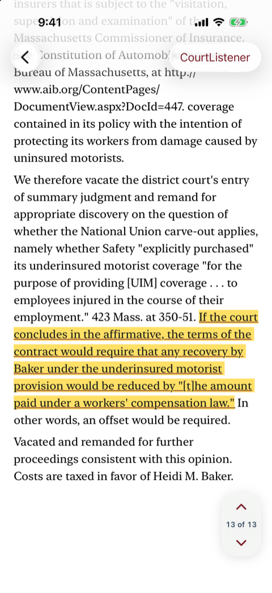<br><b>6. Further down the page</b><br><sub>The last of the 13 shaded passages</sub></td>
    <td align="center" width="25%">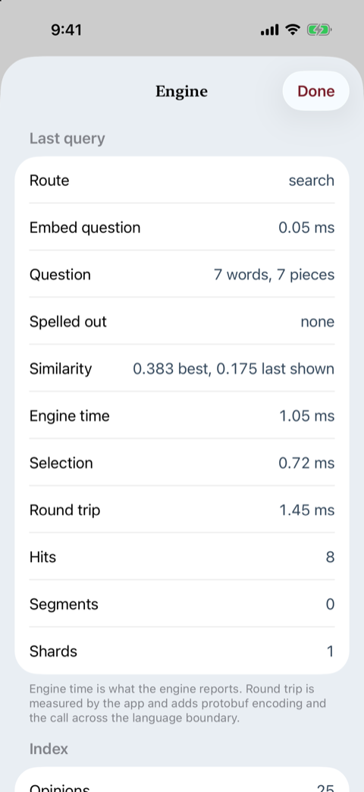<br><b>7. What the query cost</b><br><sub>Time to embed the question, its word-pieces, the similarity range, engine timings</sub></td>
    <td align="center" width="25%">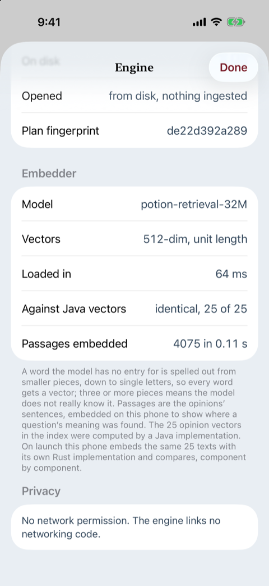<br><b>8. The embedder, checked</b><br><sub>The phone’s vectors are identical to the Java implementation’s, 25 of 25</sub></td>
  </tr>
</table>

### Search by keyword

<table>
  <tr valign="top">
    <td align="center" width="25%">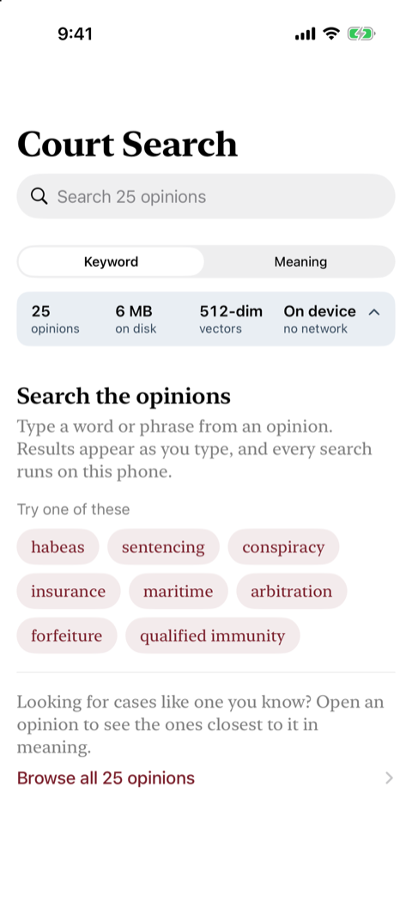<br><b>1. Type a word</b><br><sub>Or pick one; every suggestion finds something</sub></td>
    <td align="center" width="25%">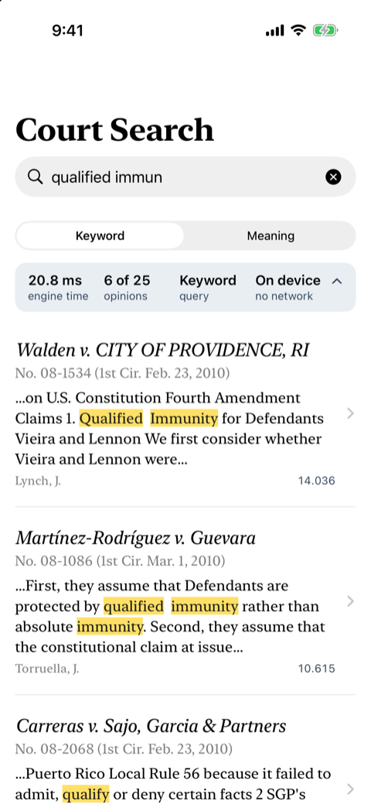<br><b>2. Results as you type</b><br><sub>“qualified immun” already matches; the engine cuts and marks each snippet itself</sub></td>
    <td align="center" width="25%">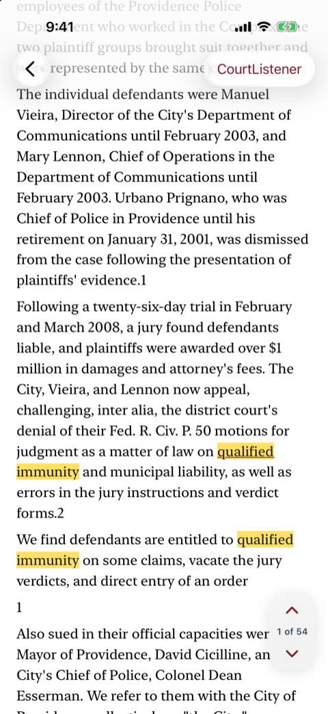<br><b>3. Every match marked</b><br><sub>Opening a result highlights each word the engine matched, 54 here</sub></td>
    <td align="center" width="25%">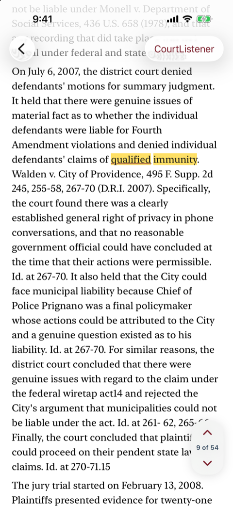<br><b>4. Step through them</b><br><sub>The same arrows, from match to match</sub></td>
  </tr>
</table>

## Why it exists

Protomolt Search's embedded runtime is designed to be the search backend of a
mobile app. This sample runs it on real phones, an iPhone XR and a Pixel 11 Pro,
and is a reference for anyone doing the same:

- **The call sequence that works**: open → plan the index from a protobuf
  descriptor → mapped ingest → flush → query, all as protobuf bytes across the
  engine's C and JNI boundary.
- **The rules the engine enforces** that the mobile path does not yet document —
  which fields a shard must declare, which field an unqualified query searches,
  how analysis is bound, when snippets are served, how type-ahead interacts with
  stemming. They were learned from the engine's refusals and are written down in
  [GUIDE.md](GUIDE.md), a practical guide to using the engine in your own app.
- **One design, two platforms**: both apps implement [DESIGN.md](DESIGN.md) and
  assert the same results in their tests.

## Results so far

| | Acceptance test | On hardware |
| --- | --- | --- |
| Host reference ([tools/wire-probe](tools/wire-probe)) | passes | — |
| iOS | passes (iPhone 17 simulator) | iPhone XR, iOS 18: first index build 2.23 s, then 1.52–1.58 s; 6.0 MB on disk; survives kill and relaunch |
| Android | passes on device | Pixel 11 Pro, Android 17: index build 2.90 s; 6.0 MB on disk |

The acceptance test is the same everywhere: ingest the 25 opinions; `habeas`
returns *Forsyth v. Spencer* then *United States v. Dowdell*, with "habeas"
marked in the engine's snippet; `hab` finds the same two; the five nearest
neighbours of the first opinion come back in a fixed order; close, reopen, check
again. Those expectations match an independent implementation, the Java/Lucene
court sample in [protomolt](https://github.com/ai-pipestream/protomolt) — the
two engines agree on ranking, and on similarity scores to within quantization.

Timings are single debug-build measurements, not benchmarks.

## How it fits together

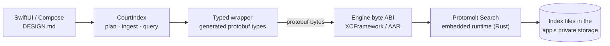

The engine is consumed exactly as an outside developer would consume it: a built
XCFramework or AAR plus its protobuf contracts, from a pinned revision. Nothing
in this repository changes the engine.

## Build and run

You need a checkout of
[protomolt-search](https://github.com/ai-pipestream/protomolt-search) **next to**
this repository, Rust with the mobile targets
(`rustup target add aarch64-apple-ios aarch64-apple-ios-sim x86_64-apple-ios aarch64-linux-android`),
and `protoc`.

**iOS** — Xcode 26, [XcodeGen](https://github.com/yonaskolb/XcodeGen).

```bash
scripts/build-engine.sh                 # engine → ios/Frameworks, about 5 minutes, once
scripts/build-embedder.sh ios           # the sample's embedder → ios/Frameworks, seconds
scripts/fetch-model.sh                  # optional: 123 MB model, enables search by meaning
cd ios && xcodegen generate && open CourtSearch.xcodeproj
```

Run `xcodegen generate` after fetching or removing the model: the project bundles
the model folder only when it exists.

Run the `CourtSearch` scheme. For a device, pick your team under Signing &
Capabilities. Launch arguments: `-query habeas` opens on results, and
`-resetIndex YES` rebuilds the index without reinstalling. The acceptance test is
the `CourtSearchKit` scheme (⌘U).

**Android** — Android SDK with an NDK, JDK 17 or newer.

```bash
scripts/build-engine-android.sh         # engine → android/libs, about 2 minutes, once
scripts/build-embedder.sh android       # the sample's embedder → jniLibs, seconds
scripts/fetch-model.sh                  # optional: 123 MB model, enables search by meaning
cd android && ./gradlew :app:installDebug
../scripts/test-android.sh              # the acceptance tests, on a device or emulator
```

`adb shell am start -n ai.pipestream.samples.courtsearch/.MainActivity --es query habeas`
opens on results; `--ez resetIndex true` rebuilds the index.

**Host reference** — the same engine calls from Rust, no phone involved:

```bash
cd tools/wire-probe && cargo run -- ../../fixtures/court_opinions_potion512.ndjson habeas
```

## Layout

```
README.md      you are here
GUIDE.md       using the engine in your own app: the calls, the rules, search by meaning, what to expect
DESIGN.md      the UX spec both apps implement
proto/         court.proto — the opinion schema every platform plans its index from
fixtures/      25 opinions with metadata and precomputed embeddings; court.desc
tools/wire-probe/   host-side Rust reference for the engine's mobile byte ABI (also the macOS side of the parity report)
tools/passages_reference.py, parity_compare.py   the text-cutting spec; the cross-platform diff
embedder-ffi/  the sample's embedder: C and JNI over protomolt-embedder, with the conformance test
ios/           CourtSearchKit (Swift package: engine wrapper + index) and the app
android/       the Android app (Kotlin, Jetpack Compose)
design/        the app icon master
scripts/       build the engine per platform; regenerate protobuf types, fixture, icons
```

## The embedder, and a result worth knowing

Protomolt Search's embedded runtime deliberately ships no embedder: vectors are
the caller's job. So the sample carries its own, [`embedder-ffi/`](embedder-ffi):
a small C and JNI surface over the engine project's Rust `protomolt-embedder`.

**The model** is [`minishlab/potion-retrieval-32M`](https://huggingface.co/minishlab/potion-retrieval-32M)
(MIT), a [Model2Vec](https://github.com/MinishLab/model2vec) *static* embedding
model: 63,091 WordPiece tokens × 512 dimensions, 123 MB. Static means there is no
neural network to run. Embedding a text is a table lookup per word-piece, a mean,
and a normalization, which is why a question embeds in about 0.03 ms on a phone,
why all 4,075 sentences of the corpus can be embedded on the device for the
heatmap, and why two implementations can agree to the last bit. The price is that
word order is ignored: it is a bag of word-pieces, a fair trade for an on-device
sample and well short of a full transformer in ranking quality. English only.

The model is a file, not code. `scripts/fetch-model.sh` downloads it (it is not in
git), and the build copies it into the app package: on iOS it is mapped straight
from the bundle; on Android, where an APK asset is not a file, it is copied into
app storage on first launch. The apps never download anything at run time, which
is what keeps the no-network claim true. Any Model2Vec WordPiece model in the same
layout would work; this one was chosen because it is the engine project's default
and publicly downloadable.

The 25 opinion vectors in the index were computed by a *different*
implementation, the Java one. On every launch each phone embeds the same 25
texts with the Rust one and compares. They are **identical in every component**
— on the host, on the iOS simulator, on an iPhone XR, and on a Pixel 11 Pro.
Two independent
implementations of the model agree bit for bit, which is what lets a phone embed
queries against an index it did not build. The engine panel shows the check.

## Same answers everywhere? Almost, and the exception is the interesting part

Every platform can print a parity report: a fixed set of keyword, meaning, and
similarity queries, with every score as its raw 32-bit pattern, so one differing
bit shows (`tools/parity_compare.py`).

| | `dotprod` | `i8mm` | Keyword (BM25) scores | Dense-vector scores |
| --- | --- | --- | --- | --- |
| macOS, Apple M2 (the probe) | yes | yes | reference | reference |
| iOS simulator, Apple M2 | yes | yes | bit-identical | bit-identical |
| Pixel 11 Pro | yes | yes | bit-identical | bit-identical |
| iPhone XR, Apple A12 (2018) | **no** | **no** | bit-identical | **differ by up to 0.0032** |

Three platforms agree on every bit of every score. The iPhone XR agrees on every
keyword score, and its embedder produces the same vectors as everyone else's, but
its dense-vector scores drift by up to 0.0032, which is enough to swap neighbours
in 4 of 11 rankings (two opinions at 0.7135 and 0.7111 come back as 0.7142 and
0.7143).

The cause is visible in the vector engine's source: it picks its kernels at run
time from two CPU features, `dotprod` and `i8mm`, and the two kernels do not
round alike. Each app prints what its CPU offers, and the XR's A12 is the only
chip here that lacks both, so it is the only one on the fallback path. Both
answers are sound approximations of the exact cosines (0.7136 and 0.7106, from
Lucene); they are simply not the *same* approximation.

Why it matters: the engine treats vector score identity as a contract, and its
proposed device-shard design compares scores computed on different phones. Plenty
of phones in use predate these instructions. For a single device nothing is wrong.
Across devices, identical scores cannot be assumed until the fallback kernel is
made to round like the fast one, or scores are compared at a coarser grain.

The embedder library is part of both apps and is built by
`scripts/build-embedder.sh` (seconds). The *model* it reads is optional: 123 MB,
not in git, fetched by `scripts/fetch-model.sh`. Without the model both apps still
build and run with keyword search and similar opinions; the Meaning switch, the
heatmap, and the conformance check simply are not there.

This sample is not the collaborative, device-owned-shard search described in the
engine's `docs/device-shards.md`; that design depends on this working first.

## Data, model, and license

- **Opinions**: U.S. federal court opinions, in the public domain, from
  [CourtListener](https://www.courtlistener.com/) by the Free Law Project. Each
  opinion in the app links back to its CourtListener page.
- **Embedding model**:
  [`minishlab/potion-retrieval-32M`](https://huggingface.co/minishlab/potion-retrieval-32M)
  (MIT), described above. It is not in this repository: the 25 opinion vectors in
  the fixture are, and `scripts/fetch-model.sh` downloads the model itself for
  search by meaning.
- **Code**: MIT, the same license as the engine's embedded package. See
  [LICENSE](LICENSE).
